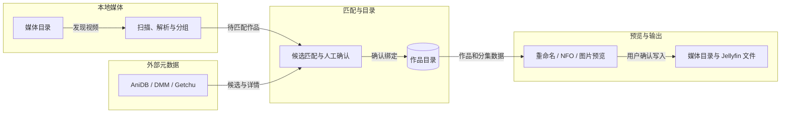
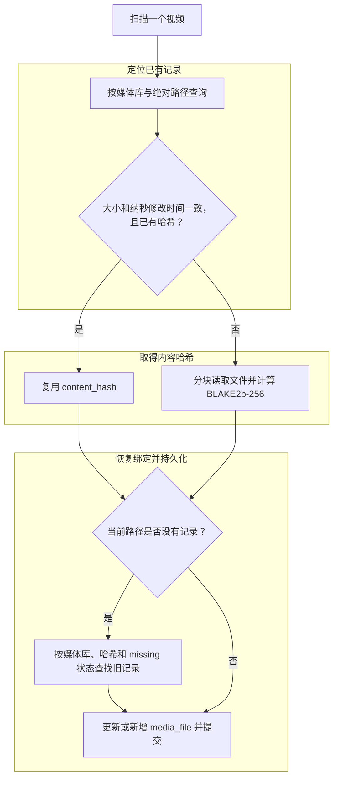
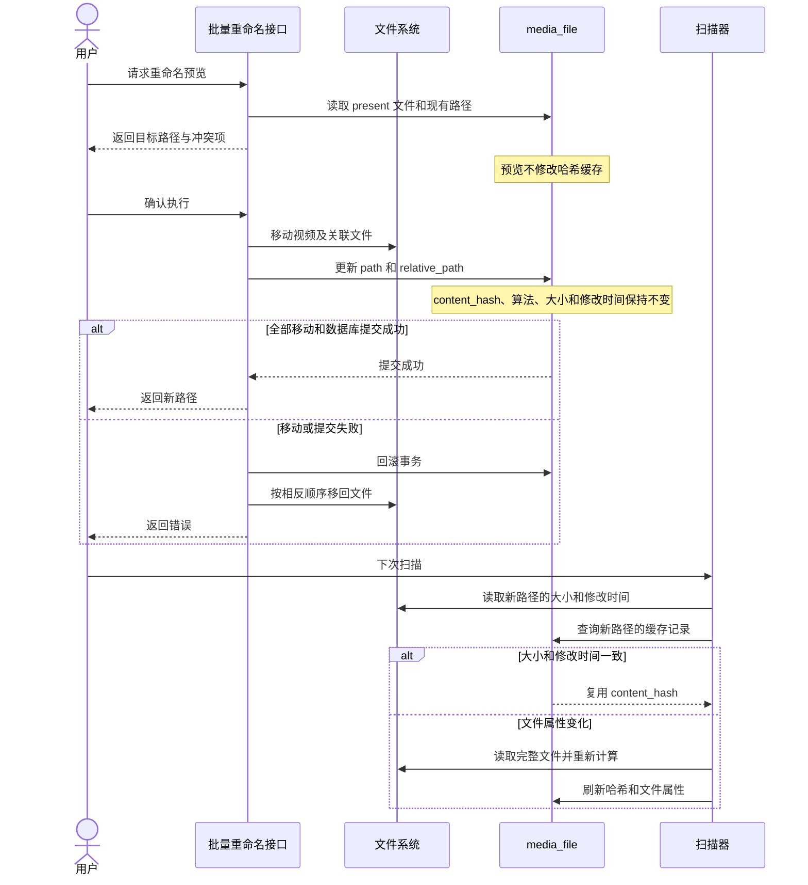

# Anime Manager

一个本地运行、人工确认优先的动漫媒体刮削管理器。它不会自动移动或删除媒体文件；所有 NFO 与图片写入都需要先预览，再由用户明确确认。

## 当前能力

- 扫描本地媒体目录，使用 BLAKE2b-256 内容哈希识别改名文件。
- 从文件名解析作品标题与集号；同一子目录内尚未绑定的文件自动合并为一个待确认分组。
- 使用 AniDB 官方标题库进行本地候选搜索，支持英文、日文、罗马字等别名匹配，候选统一优先显示日文标题。
- 确认候选后通过 AniDB HTTP XML API 获取详情，作品主标题按日文、AniDB 主标题、英文的顺序回退。
- 通过 DMM/FANZA Web Service API 搜索动画商品并读取真实元数据。
- 通过 Getchu 官方站内检索和商品详情页搜索动画商品并读取真实元数据。
- 每个来源独立选择候选，永久保存外部 ID 和字段来源。
- 生成 Jellyfin 优先的 `tvshow.nfo`、剧集 NFO 或 `movie.nfo`。
- 写入前展示差异；覆盖时自动保留时间戳备份。
- 可将待确认分组直接添加到已有作品，不重复创建作品或 AniDB 映射。
- 支持预览后将作品视频批量移动到日文作品目录，并按 `作品名 - SxxExx - 集标题.ext` 重命名；目标冲突时禁止执行。

## 数据流



主图刻意保持 7 个节点：`作品目录` 抽象了 `anime`、`media_file`、`match_group`、`source_mapping`、候选和来源快照等持久化细节；外部来源也先聚合为一个元数据边界。

`anime` 保存作品级元数据，例如标题、年份、类型和总集数；`media_file` 每行对应一个实际媒体文件，通过 `anime_id` 绑定作品，并在 `episode` 字段保存该文件的集号。总集数 `anime.episode_count` 与单文件集号 `media_file.episode` 是两个独立字段。当前可在作品详情中修改单个文件的集号。

### BLAKE2b-256 哈希缓存

文件内容哈希持久化在 `media_file` 表的 `content_hash` 字段中，`hash_algorithm` 记录为 `blake2b-256`；这份缓存属于数据库记录，不使用 `data/cache` 目录。扫描同一路径时，只有数据库中记录的 `size` 和 `modified_ns` 与当前文件完全一致且已有哈希，才直接复用缓存。缓存未命中时，扫描器按 4 MiB 分块读取完整文件并重新计算哈希。



扫描开始时，同一媒体库的旧记录会先标记为 `missing`。因此文件在程序外被改名后，新路径会重新计算哈希，再通过相同的 `content_hash` 找回旧记录及其作品绑定；仅仅依靠哈希找回改名记录并不能省略这次计算。

作品详情和“全部作品”的批量重命名走另一条路径：预览阶段不修改缓存；确认执行后移动文件，只更新 `media_file.path` 和 `relative_path`，保留原来的 `content_hash`、`hash_algorithm`、`size` 和 `modified_ns`。同一媒体库内的正常重命名不改变文件内容和修改时间，因此下次扫描可以直接命中原缓存；如果底层文件属性发生变化，下次扫描会自动重新计算。



### 添加新集与批量重命名

扫描新视频后，可在“待确认”页面的“添加到已绑定作品”区域搜索现有作品并直接加入。该操作只设置分组和视频的 `anime_id`，不会重复创建作品，也不会覆盖已有 AniDB 来源映射。若仍按 AniDB 候选确认，而所选 AID 已绑定到某个作品，系统也会自动复用该作品。

作品详情中的“批量重命名”会先显示完整预览。默认将视频移动到媒体库根目录下以当前作品标题命名的目录，并生成：

```text
作品名/作品名 - S01E03 - 集标题.mp4
```

文件扩展名保持不变并规范为小写。集标题来自原文件名中集号之后的文本；缺少集标题时生成 `作品名 - S01E03.ext`。缺少集号、目标文件已经存在或多个文件生成相同目标时，操作会被阻止。确认执行后，程序同步更新 `media_file.path` 和 `relative_path`；不会覆盖已有视频。

## Windows 启动

要求 Python 3.12+、Node.js 20+，推荐安装 ffprobe 以读取视频参数。

```powershell
.\scripts\setup.ps1
.\scripts\start.ps1
```

打开 <http://127.0.0.1:5173>。停止服务：

```powershell
.\scripts\stop.ps1
```

## AniDB 配置

首次搜索会下载 AniDB 官方标题库，之后 24 小时内不会重复下载。标题搜索不需要账号；确认 AniDB 候选并获取详情前，需要在“设置”中填写 AniDB 已注册的 HTTP API `client` 和 `clientver`。

项目不抓取 AniDB 网页，并把详情请求限制为至少 2 秒一次、同一 AID 当日复用缓存。

### DMM / Getchu 配置

DMM/FANZA 使用官方 Web Service API v3。需要先完成 DMM Affiliate 和 Web Service
利用注册，然后在“设置”中填写 API ID 与 API 专用 Affiliate ID。搜索范围固定为
FANZA 的数字动画楼层（`digital/anime`），不会回退到模拟数据。

Getchu 不需要账号或 API 密钥。应用使用 Getchu 官方详细搜索页的“动画 DVD”类目进行
标题检索，并在确认候选后读取商品详情。DMM 与 Getchu 的详情结果都会缓存一天。

### 标题库与语言策略

AniDB 标题库中一部动画可以有多个标题。程序会将每个标题分别存入 `anidb_title` 表，并通过相同的 AniDB AID 关联：

| 字段 | 内容 |
| --- | --- |
| `aid` | AniDB 动画 ID，同一作品的标题共享该 ID |
| `title` | 原始标题文本 |
| `normalized_title` | 用于本地模糊匹配的标准化标题 |
| `language` | AniDB 语言代码，例如 `ja`、`x-jat`、`en` |
| `title_type` | 标题类型，例如 `main`、`official`、`synonym` |

搜索时，所有语言和别名都会参与相似度计算，因此仍可用英文或罗马字搜索；确定匹配的 AID 后，候选标题按以下顺序显示：

1. 日文标题（`ja`）
2. AniDB 罗马字主标题（`x-jat`）
3. 英文标题（`en`）
4. 其他语言标题

确认并获取详情后，作品主标题使用“日文官方标题 > 其他日文标题 > AniDB 主标题 > 英文标题”的回退顺序。`original_title` 同样优先保存日文标题。已有作品可在详情中点击“刷新元数据”应用当前标题策略；即使 AniDB 详情命中一天内的缓存，标题也会重新按本地标题库的语言优先级选择。

## 开发验证

```powershell
backend\.venv\Scripts\python.exe -m pytest backend\tests
Set-Location frontend
npm test
npm run build
```

数据库迁移文件位于 `backend/alembic`，默认数据文件是 `backend/data/anime.db`。
